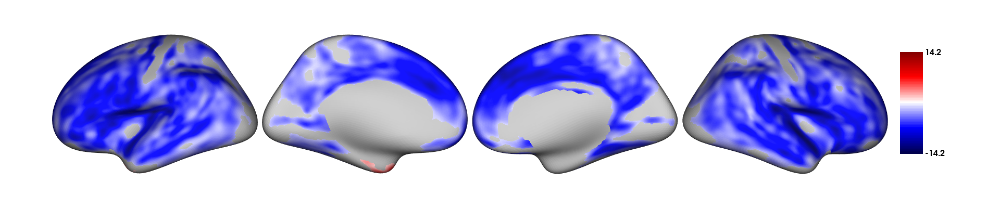
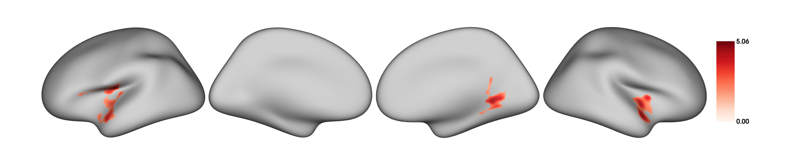

## VertexWiseR: a package for simplified vertex-wise analyses of whole-brain and hippocampal surface in R 

<!-- -->

### Setting up for the first time

VertexWiseR can be installed and loaded using the following code in R:

``` r 
install.packages('VertexWiseR')
library(VertexWiseR)

##Alternatively
#install.packages("devtools")
#devtools::install_github("CogBrainHealthLab/VertexWiseR")
``` 

VertexWiseR imports and makes use of the R package [reticulate](https://rstudio.github.io/reticulate/). `reticulate` is a package that allows R to borrow or translate python functions into R. Using reticulate, the package calls functions from the [BrainStat](https://brainstat.readthedocs.io/en/latest/) Python module. Brainstat also comes with a number of fsaverage templates that need to be downloaded for use with VertexWiseR cortical analyses.

For reticulate to work properly with VertexWiseR, the latest version of `Miniconda` needs to be installed with it — Miniconda is a lightweight version of Python, specifically for use within RStudio. Alternatively, a suitable version of Python must be installed.

A function can be run to download and install all the system requirements (Miniconda, brainstat, BrainStat's fsaverage/parcellation templates) if they are not installed yet:

``` r
VWRfirstrun()
```

#### Loading datasets

For this example, we use Spreng and colleagues' neurocognitive aging [openneuro dataset ds003592](https://openneuro.org/datasets/ds003592/versions/1.0.13):

``` r 
demodata = readRDS(system.file('demo_data/SPRENG_behdata_site1.rds', package = 'VertexWiseR'))
``` 

The dataset T1 weighted images were preprocessed using the recon-all [FreeSurfer](https://surfer.nmr.mgh.harvard.edu/fswiki/FreeSurferWiki) pipeline. This tutorial will not reiterate these steps. For a detailed guide about surface extraction (from FreeSurfer, fMRIprep, HPC and HippUnfold outputs), see the [Extracting surface data in VertexWiseR](https://cogbrainhealthlab.github.io/VertexWiseR/articles/VertexWiseR_surface_extraction.html) article.

Here, we explain how, from a given FreeSurfer subject directory, VertexWiseR extracts surface-based measures and synthesizes the whole-sample data into a compact matrix object (.rds) for later analyses. 

SURFvextract() gives the opportunity to extract surface-based measures including 'thickness', 'curv', 'sulc', and 'area'. Here, we are interested in cortical thickness:

``` r 
SURFvextract(sdirpath = "MY_SUBJECTS_DIR/", filename = "SPRENG_CTv.rds", measure = "thickness") 
``` 

A cortical thickness (CT) matrix object extracted from the Spreng dataset is included in the VertexWiseR git repository and can be loaded with the following code:

``` r 
SPRENG_CTv=readRDS(file=url("https://github.com/CogBrainHealthLab/VertexWiseR/blob/main/inst/demo_data/SPRENG_CTv_site1.rds?raw=TRUE"))
``` 
#### Smoothing the surface data

VertexWiseR gives the option to smooth the surface data with a desired full width at half maximum (FWHM) value. It can also optionally directly be done as an option for RFT_vertex_analysis() which will be discussed below. Here, we smooth it before the analysis at 10 mm:

```r
SPRENG_CTv = smooth_surf(SPRENG_CTv, 10)
``` 

#### Preparing the model

The vertex-wise analysis model works as a multiple regression model where the Dependent Variable/outcome is the CT at each vertex, and you will decide which Independent Variables/predictors to enter into the model to predict the vertices’ CT. In this example, we shall use `age` and `sex` to predict CT. Among these IVs, we are mostly interested in age, sex being entered into the model to control for its confounding influence on CT. We thus select those two variables and save them into a new data.frame called `all_pred`.

``` r
all_pred=demodata[,c("sex","age")]
head(all_pred)
```

    ##   sex age
    ## 1 F   21
    ## 2 F   73
    ## 3 F   77
    ## 4 M   68
    ## 5 F   60
    ## 6 F   71

#### The actual analysis

The next code chunk runs the analysis. There is an optional `p`
parameter for the `RFT_vertex_analysis()` function to specify the p
threshold; default p is set to 0.05. The atlas with which to label the significant clusters can also be set (1=aparc/Desikan-Killiany-70 (default), 2=Schaefer-100, 3=Schaefer-200, 4=Glasser-360, 5=Destrieux-148). 

The second line displays the results.

``` r
results=RFT_vertex_analysis(model = all_pred, contrast =all_pred$age, surf_data = SPRENG_CTv, atlas = 1)
print(results$cluster_level_results)
```

    ## $`Positive contrast`
    ## clusid nverts     P     X    Y   Z tstat          region
    ## 1      1    142 0.015 -22.8 11.5 -42  6.45 lh-temporalpole

    ## $`Negative contrast`
    ##   clusid nverts      P   X     Y     Z  tstat              region
    ## 1      1   8039 <0.001  47   4.0 -16.6 -12.64 rh-superiortemporal
    ## 2      2   7660 <0.001 -34 -25.7  16.2 -14.23           lh-insula

In the above results, the clusters that appear under the
`Positive contrast` section are clusters of vertices which correlate positively with your `contrast` variable, vice-versa for the `Negative contrast`. 

- `nverts`: number of vertices in the cluster

- `P`: p-value of the cluster

- `X, Y and Z`: MNI coordinates of the vertex with the highest t-stat in the cluster

- `tstat`: t statistic of the vertex with the highest t-stat in the
  cluster

- `region`: the region this highest t-stat vertex is located in. Here, it is determined/labelled using the [Desikan atlas](https://surfer.nmr.mgh.harvard.edu/ftp/articles/desikan06-parcellation.pdf)

#### Plotting

``` r
plot_surf(surf_data = results$thresholded_tstat_map, filename = 'sigcluster.png', surface = 'inflated', cmap = 'seismic')
```

- `surf_data`: A numeric vector (length of V) or a matrix (N rows x V columns), where N is the number of subplots, and V is the number of vertices. It can be the output from SURFvextract(), FSLRvextract(), HIPvextract() as well as masks or vertex-wise results outputted by analyses functions.

- `filename`: A string object containing the desired name of the output .png. Default is 'plot.png' in the R temporary directory (tempdir()).Only filenames with a .png extension are allowed.

- `cmap` (optional) : A string object specifying the name of an existing colormap or a vector of hexadecimal color codes to be used as a custom colormap. The names of existing colormaps are listed in the \href{https://matplotlib.org/stable/gallery/color/colormap_reference.html}{Matplotlib plotting library}. 

  Default cmap is set to `"Reds"` for positive values, `"Blues_r"` for   negative values and `"RdBu"` when both positive and negative values    exist. 

- `title` (optional) : A string object for setting the title in the plot. Default is none. For titles that too long to be fully displayed within the plot, we recommend splitting them into multiple lines by inserting "\\n".

- `surface` (optional) : A string object containing the name of the type of cortical surface background rendered. Possible options include `"white"`, `"smoothwm"`,`"pial"` and `"inflated"` (default). The surface parameter is ignored for hippocampal surface data.
  


#### Extracting the CT values for each subject

If you want to carry out some follow-up analyses (e.g., mediation), you might want to extract, for each subject in the dataset, the mean CT in the significant clusters colored in red (positive clusters). You can simply do a matrix multiplication (operator for matrix multiplication :`%*%`) between the CT data `SPRENG_CTv` and the positive mask `results$pos_mask` . A mask in the context of brain images refers to a vector of 1s and 0s. In this case, the vertices which are within the significant clusters are coded as 1s, vertices outside these significant clusters are coded as 0s. `sum(results$pos_mask)` gives you the sum of all the 1s, which essentially is the number of significant vertices.

Thus, the `SPRENG_CTv %*% results$pos_mask` is divided by
`sum(results$pos_mask)` to obtain an average CT value. Here, this average CT is saved into a new variable `sig_avCT` within the `demodata` dataframe.

``` r
demodata$sig_avCT=SPRENG_CTv %*% results$pos_mask/sum(results$pos_mask)
head(demodata$sig_avCT)
```

    ##         [,1]
    ##[1,] 2.769453
    ##[2,] 3.003829
    ##[3,] 2.586192
    ##[4,] 2.851196
    ##[5,] 3.199390
    ##[6,] 3.050331

As a sanity check, these mean CT values should correlate with
`age`

``` r
cor.test(demodata$sig_avCT,demodata$age)
```

    ## 
    ##Pearson's product-moment correlation
    ##
    ##data:  demodata$sig_avCT and demodata$age
    ##t = 4.826, df = 236, p-value = 2.502e-06
    ##alternative hypothesis: true correlation is not equal to 0
    ##95 percent confidence interval:
    ## 0.1793792 0.4111954
    ##sample estimates:
    ##      cor 
    ##0.2997047 


Image decoding
================

### Introduction

After running the whole-brain vertex-wise analyses, you may be able to
identify regions in the brain in which cortical thickness (CT) values
are significantly different between groups or these CT values predict a certain IV significantly. How do we make sense of these regions? We can plot out the results using the `plot_surf()` function, but still, it may be difficult to interpret the results in terms of the functional relevance of the regions identified. Here we present a tool that you can use to facilitate such interpretations.

What this tool does is correlate your input image (cortical surface
maps obtained from an earlier vertex-wise analysis, currently supporting fsaverage5 surface space) with images from a large database of task-based fMRI and voxel-based morphometric studies. Each of these images in the database is tagged with a few keywords, describing the task and/or sample characteristics. The correlations that are carried out essentially measure how similar your input image is to each of the images in the database. Higher correlations would mean that your input image looks very similar to a certain image in the database, thus the keywords associated with that image in the database would be highly relevant to your input image.

In this example, we will first run a whole-brain vertex-wise
analysis to compare the cortical thickness between males and females in the young adult population of the SPRENG dataset. The thresholded
cortical surface maps obtained from this analysis will then be fed into an image-decoding procedure to identify keywords that are relevant to our results

### Source custom-made R functions from Github

The [NiMARE](https://nimare.readthedocs.io/en/stable/index.html) python module is needed in order for the imaging decoding to work. It is similarly imported by VertexWiseR via reticulate in the decode_surf_data() function. 

### Load and prepare data

``` r
#filter out old participants
dat_beh=demodata[demodata$agegroup=="Y",]
dat_CT=SPRENG_CTv[demodata$agegroup=="Y",]

all_pred=dat_beh[,c("site","age","sex")]
head(all_pred)
```

    ##    site age sex
    ## 1     1  21   F
    ## 15    1  32   M
    ## 16    1  20   M
    ## 17    1  21   M
    ## 18    1  24   M
    ## 19    1  20   M

### Vertex-wise analysis

``` r
results=RFT_vertex_analysis(model = all_pred, contrast =all_pred$sex, surf_data = dat_CT)
results$cluster_level_results
```

    ## The binary variable 'sex' will be recoded with F=0 and M=1 for the analysis
    ## 
    ## smooth_FWHM argument was not given. surf_data will not be smoothed here.
    ## 
    ## $`Positive contrast`
    ##   clusid nverts      P     X     Y     Z tstat              region
    ## 1      1    301 <0.001 -40.7 -13.0  16.5  5.06      lh-postcentral
    ## 2      2    181  0.002  56.3  12.1 -10.1  4.43 rh-superiortemporal
    ## 3      3    150  0.003  21.9 -51.6  -1.2  4.41          rh-lingual
    ## 
    ## $`Negative contrast`
    ## [1] "No significant clusters"

``` r
plot_surf(surf_data = results$thresholded_tstat_map,filename = "sexdiff.png")
```



According to these results, since the female sex is coded as 0 and males as 1 (this can be done manually beforehand), the regions colored in red are thicker in males.

### Image decoding

Now, let's enter the `thresholded_tstat_map` into the `decode_img()`
function. The previous results only contained positive clusters. But in case of bidirectionality, the function requires to choose one direction with the contrast option. In this instance, we simply decode the positive clusters, by setting `contrast="positive"`.

If you are running this for the first time, a ~7.5 MB file
`neurosynth_dataset.pkl.gz` needs to be downloaded to your current
directory for the decoding to work. This file will contain the images from the [Neurosynth](https://neurosynth.org/) database that will be correlated with your input image. Run VWRfirstrun(requirement='neurosynth') to assist you with the data's installation.

``` r
keywords=decode_surf_data(surf_data=results$thresholded_tstat_map, contrast = "positive")
```

    ##Converting and interpolating the surface data ... 
    ##✓ 
    ## Correlating input image with images in the neurosynth database. This may take a while ... 
    ##
    ##✓    
``` r
print(keywords[1:10,])
```

    ##      keyword     r
    ##449      pain 0.099
    ##50   auditory 0.098
    ##648  temporal 0.093
    ##617    speech 0.092
    ##334 listening 0.089
    ##607    sounds 0.070
    ##450   painful 0.068
    ##4    acoustic 0.062
    ##397     music 0.062
    ##398   musical 0.062

The above procedure will display the top 10 keywords from images in the
database that are the most correlated with your input image.
According to these results, you can see that the positive clusters (which are thicker in males) are typically found to be associated with pain and auditory processing. If you simply run `keyword` without
specifying the index within the square brackets `[1:10,]`. All 715
keywords will be displayed.

In your presentation slides or results section of your paper, you might
want to illustrate these keywords using the [wordcloud](https://www.rdocumentation.org/packages/wordcloud/versions/2.6) and [paletteer](https://CRAN.R-project.org/package=paletteer) packages. You can set the size of the keyword to vary according to its r value:

``` r
#install.packages("wordcloud","paletteer")
library(wordcloud)
library(paletteer)

wordcloud(words = keywords$keyword, ##keyword input
          freq = keywords$r, ##setting the size of the keyword to vary with its r value
          min.freq = 0.05, ##minimum r value in order for the keyword to be displayed
          colors=paletteer_c("grDevices::Temps", 10) ##color scheme
          ,scale=c(1,2) 
          ) 
          par(mar = rep(0, 4))
```

<!-- -->

These keywords may not be very accurate but they should give a rough idea for interpreting your results. Take note that these keywords are specific to the positive clusters.
