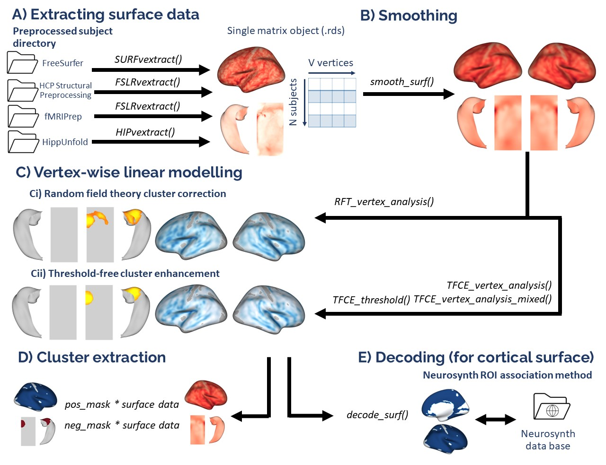
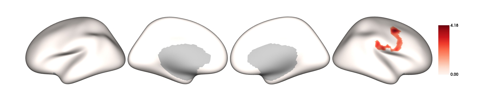
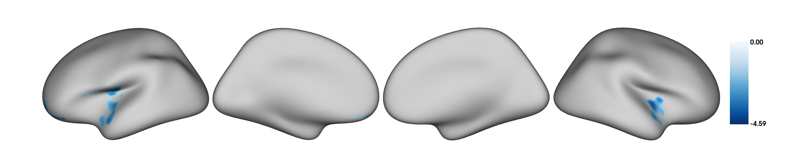
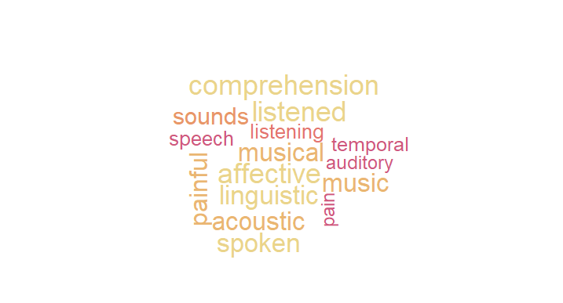

VertexWiseR: a package for simplified vertex-wise analyses of whole-brain and hippocampal surface in R 

<!-- -->

### Setting up for the first time

VertexWiseR can be installed and loaded using the following code in R:

``` r 
install.packages("devtools")
devtools::install_github("CogBrainHealthLab/VertexWiseR")
library(VertexWiseR)

##not yet available on CRAN at the moment
    #install.packages('VertexWiseR')
``` 

VertexWiseR imports and makes use of the R package `reticulate`. `reticulate` is a package that allows R to borrow or translate python functions into R. Using reticulate, the package calls functions from the `brainstat` python module. Brainstat also comes with a number of fsaverage templates that need to be downloaded for use with VertexWiseR cortical analyses.

For reticulate to work properly with VertexWiseR, the latest version of `miniconda` needs to be installed with it — miniconda is a lightweight version of python, specifically for use within RStudio. 

A function can be run to download and install all the system requirements (miniconda, brainstat, brainstat's fsaverage templates) if they are not installed yet:

``` r
VWRfirstrun()
```

#### Load datasets

For this example, we use Spreng and colleagues's neurocognitive aging [openneuro dataset ds003592](https://openneuro.org/datasets/ds003592/versions/1.0.13):

``` r 
demodata = readRDS(system.file('demo_data/SPRENG_behdata_site1.rds', package = 'VertexWiseR'))
``` 

The dataset T1 weighted images were preprocessed using the recon-all [Freesurfer](https://surfer.nmr.mgh.harvard.edu/fswiki/FreeSurferWiki) pipeline. This tutorial will not reiterate these steps and simply explain how, from a given Freesurfer subject directory, VertexWiseR extracts surface-based measures and synthesies the whole-sample data into a compact matrix object (.rds) for later analyses. 

HIPvextract() gives the opportuntity to extract surface-based measures including 'thickness', 'curv', 'sulc', and 'area'. Here, we are intersted in cortical thickness:

``` r 
HIPvextract(sdirpath = "MY_SUBJECTS_DIR/", filename = "SPRENG_CTv.rds", measure = "thickness") 
``` 

A CT matrix object extracted from this dataset is included in the VertexWiseR git repository and can be downloaded with the following code:

``` r 
SPRENG_CTv=readRDS(file=url("https://github.com/CogBrainHealthLab/VertexWiseR/blob/main/inst/demo_data/SPRENG_CTv_site1.rds?raw=TRUE"))
``` 
#### Smoothing the surface data

VertexWiseR gives the option to smooth the surface data with a desiredfull width at half maximum (FWHM) value. It can also optionally directly be done as an option for vertex_analysis() which will be discussed below. Here, we smooth it before the analysis at 10 mm:

``` r 
SPRENG_CTv = smooth_surf(SPRENG_CTv, 10)
``` 

#### Preparing the model

The vertex-wise analysis model works as a multiple regression model where the Dependent Variable/outcome is the cortical thickness (CT) at each vertex, and you will decide which Independent Variables/predictors to enter into the model to predict the vertices’ CT. In this example, we shall use `age` and `sex` to predict CT. Among these IVs, we are mostly interested in age, sex being entered into the model to control for its confounding influence on CT. We thus select those two variables and save them into a new data.frame called `all_pred`

``` r
all_pred=demodata[,c(2,7)]
head(all_pred)
```

    ##   gender age
    ## 1      F  21
    ## 2      F  73
    ## 3      F  77
    ## 4      M  68
    ## 5      F  60
    ## 6      F  71

#### The actual analysis

The next code chunk runs the analysis. There is an optional `p`
parameter for the `vertex_analysis()` function to specify the p
threshold; default p is set to 0.05. The atlas with which to label the significant clusters can also be set (1=Aparc (default), 2=Destrieux-148, 3=Glasser-360, 4=Schaefer-100, 5=Schaefer-200, 6=Schaefer-400.). 

The second line displays the results.

``` r
results=vertex_analysis(model = all_pred, contrast =all_pred$age, surf_data = SPRENG_CTv, atlas = 1)
print(results$cluster_level_results)
```

    ## $`Positive contrast`
    ##   clusid nverts     P     X    Y   Z tstat          region
    ## 1      1    173 0.002 -22.8 11.5 -42  7.98 lh-temporalpole
    ## 
    ## $`Negative contrast`
    ##   clusid nverts      P     X     Y    Z  tstat           region
    ## 1      1   8163 <0.001  37.3 -31.6 16.3 -14.23 rh-supramarginal
    ## 2      2   8052 <0.001 -34.0 -25.7 16.2 -15.29        lh-insula

In the above results, the clusters that appear under the
`Positive contrast` section are clusters of vertices which correlate positively with your `contrast` variable, vice-versa for the `Negative contrast`. In this instance, there are no significant clusters in the `Negative contrast`.

- `nverts`: number of vertices in the cluster

- `P`: p-value of the cluster

- `X, Y and Z`: MNI coordinates of the vertex with the highest t-stat in the cluster.

- `tstat`: t statistic of the vertex with the highest t-stat in the
  cluster

- `region`: the region this highest t-stat vertex is located in. Here, it is determined/labelled using the [Desikan atlas](https://surfer.nmr.mgh.harvard.edu/ftp/articles/desikan06-parcellation.pdf)

#### Plotting

``` r
plot_surf(surf_data = results$thresholded_tstat_map, filename = 'sigcluster.jpg', surface = 'inflated', cmap = 'seismic')
```

    ## [1] "C:\\Users\\Admin\\My Drive\\workspace for analyses\\sigcluster.jpg"

- `surf_data`: A matrix object containing the surface data (N rows for participants and M columns for vertices). It can be the output from SURFvextract() as well as masks outputted by analyses functions.

- `filename`: filename of the output image

- `cmap` (optional) : A string object containing the colormap for the plot. Options are listed in the \href{https://matplotlib.org/stable/gallery/color/colormap_reference.html}{Matplotlib plotting library}. 

  Default cmap is set to `"Reds"` for positive values, `"Blues"` for
  negative values and `"RdBu"` when both positive and negative values
  exist. 

- `title` (optional) : text label displayed on the left

- `surface` (optional) : type of cortical surface background rendered.
  Possible options include `"white"`, `"smoothwm"`,`"pial"` and
  `"inflated"` (default)
  


#### Extracting the CT values for each subject

If you want to carry out some follow-up analyses (e.g., mediation), you might want to extract, for each subject in the dataset, the mean CT in the significant clusters colored in red (positive clusters). You can simply do a matrix multiplication (operator for matrix multiplication :`%*%`) between the CT data `SPRENG_CTv` and the positive mask `results$pos_mask` . A mask in the context of brain images refers to a vector of 1s and 0s. In this case, the vertices which are within the significant clusters are coded as 1s, vertices outside these significant clusters are coded as 0s. `sum(results$pos_mask)` gives you the sum of
all the 1s, which essentially is the number of significant vertices.
Thus, the `SPRENG_CTv %*% results$pos_mask` is divided by
`sum(results$pos_mask)` to obtain an average CT value. Here, this average CT is saved into a new variable `sig_avCT` within the `demodata` dataframe.

``` r
demodata$sig_avCT=SPRENG_CTv %*% results$pos_mask/sum(results$pos_mask)
head(demodata$sig_avCT)
```

    ##          [,1]
    ## [1,] 2.728489
    ## [2,] 2.974559
    ## [3,] 2.573237
    ## [4,] 2.886865
    ## [5,] 3.169464
    ## [6,] 3.007699

as a sanity check, these mean CT values should correlate with
`age`

``` r
cor.test(demodata$sig_avCT,demodata$age)
```

    ## 
    ##  Pearson's product-moment correlation
    ## 
    ## data:  demodata$sig_avCT and demodata$age
    ## t = 5.5789, df = 299, p-value = 5.423e-08
    ## alternative hypothesis: true correlation is not equal to 0
    ## 95 percent confidence interval:
    ##  0.2009735 0.4060082
    ## sample estimates:
    ##       cor 
    ## 0.3070495 

Image decoding
================

### Introduction

After running the whole-brain vertex-wise analyses, you may be able to
identify regions in the brain in which cortical thickness (CT) values
are significantly different between groups or these CT values predict a certain IV significantly. How do we make sense of these regions? We can plot out the results using the `plot_surf()` function, but still, it may be difficult to interpret the results in terms of the functional relevance of the regions identified. So here’s a tool you can use to facilitate such interpretations.

What this tool does is to correlate your input image (cortical surface
maps obtained from an earlier vertex-wise analysis) with images from a
large database of task-based fMRI and voxel-based morphometric studies. Each of these images in the database is tagged with a few keywords, describing the task and/or sample characteristics. The correlations that are carried out essentially measure how similar your input image is to each of the images in the database. Higher correlations would mean that your input image looks very similar to a certain image in the database, thus the keywords associated with that image in the database would be highly relevant to your input image.

In this worked example, we will first run a whole-brain vertex-wise
analysis to compare the cortical thickness between males and females in the young adult population of the SPRENG dataset. The thresholded
cortical surface maps obtained from this analysis will then be fed into an image-decoding procedure to identify keywords that are relevant to our results

### Source custom-made R functions from Github

The [NiMARE](https://nimare.readthedocs.io/en/stable/index.html) python module is needed in order for the imaging decoding to work. It is similarly imported by VertexWiseR via reticulate in the decode_surf_data() function. 

### Load and prepare data

``` r
#filter out old participants
dat_beh=demodata[demodata$agegroup=="Y",]
dat_CT=SPRENG_CTv[demodata$agegroup=="Y",]

##recoding categorical variables into numeric form for the vertex-wise analysis
dat_beh$sex_recode=0
dat_beh$sex_recode[dat_beh$gender=="F"]=1
all_pred=dat_beh[,c(3,7,72)]

head(all_pred)
```

    ##    site age sex_recode
    ## 1     1  21          1
    ## 15    1  32          0
    ## 16    1  20          0
    ## 17    1  21          0
    ## 18    1  24          0
    ## 19    1  20          0

### Vertex-wise analysis

``` r
results=vertex_analysis(model = all_pred, contrast =all_pred$sex_recode, surf_data = dat_CT)
results$cluster_level_results
```

    ## $`Positive contrast`
    ## [1] "No significant clusters"
    ## 
    ## $`Negative contrast`
    ##   clusid nverts      P     X     Y    Z tstat                  region
    ## 1      1    300 <0.001 -39.2 -12.6 16.2 -4.59               lh-insula
    ## 2      2    157  0.007  40.0 -15.9 -5.7 -4.22               rh-insula
    ## 3      3    103  0.009 -19.3  57.2 -6.2 -3.19 lh-rostralmiddlefrontal

``` r
plot_surf(surf_data = results$thresholded_tstat_map,filename = "sexdiff.jpg")
```

    ## [1] "C:\\Users\\Admin\\My Drive\\workspace for analyses\\sexdiff.jpg"



According to these results, since the female sex is coded as 1 and males as 0, the regions colored in cyan are thicker in males

### Image decoding

Now, let's enter the `thresholded_tstat_map` into the `decode_img()`
function. The previous results only contained negative clusters. But in case of bidirectionality, the function requires to choose one direction with the contrast option. In this instance, we simply decode the negative clusters, by setting `contrast="negative"`.

If you are running this for the first time, a ~8 MB file
`neurosynth_dataset.pkl.gz` will be downloaded to your current
directory. This file will contain the images from the
[Neurosynth](https://neurosynth.org/) database that will be correlated
with your input image.

``` r
keywords=decode_surf_data(surf_data=results$thresholded_tstat_map, contrast = "negative")
```

    ## Correlating input image with images in the neurosynth database. This may take a while

``` r
print(keywords[1:10,])
```

    ##    keyword     r
    ## 524      pain 0.109
    ## 57   auditory 0.088
    ## 718    speech 0.087
    ## 392 listening 0.084
    ## 763  temporal 0.077
    ## 525   painful 0.076
    ## 460   musical 0.064
    ## 459     music 0.062
    ## 707    sounds 0.062
    ## 661 secondary 0.057

The above procedure will display the top 10 keywords from images in the
database that are the most correlated with your input image.
According to these results, you can see that the negative clusters (which are thicker in males) are typically found to be associated with pain and auditory processing. If you simply run `keyword` without
specifying the index within the square brackets `[1:10,]`. All 847
keywords will be displayed.

In your presentation slides or results section of your paper, you might
want to illustrate these keywords using a wordcloud. You can set the
size of the keyword to vary according to its r value

``` r
#install.packages("wordcloud","paletteer")
library(wordcloud)
```

    ## Loading required package: RColorBrewer

``` r
library(paletteer)

wordcloud(words = keywords$keyword, ##keyword input
          freq = keywords$r, ##setting the size of the keyword to vary with its r value
          min.freq = 0.05, ##minimum r value in order for the keyword to be displayed
          colors=paletteer_c("grDevices::Temps", 10) ##color scheme
          ,scale=c(1,2) 
          ) 
          par(mar = rep(0, 4))
```

<!-- -->

These keywords may not be very accurate but they should give a rough idea for interpreting your results. Take note that these keywords are specific to the negative clusters.
