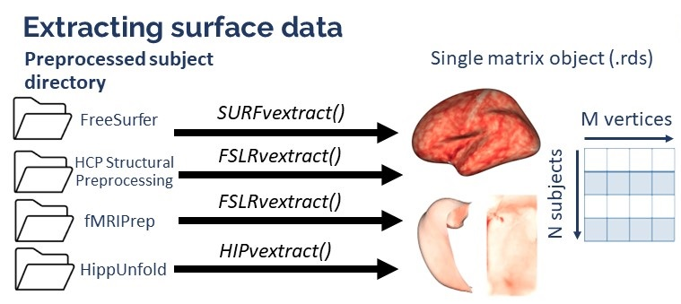

```{r setup, include=FALSE}
knitr::opts_chunk$set(warning = FALSE, message = FALSE) 
library(VertexWiseR)
```

Three functions in VertexWiseR do surface data extraction and synthesis: SURFvextract(), FSLRvextract() and HIPvextract().

Surface extraction consists in reading through a preprocessing pipeline's subjects directory, collating the surface data (for a chosen vertex-wise measures, e.g. thickness), and summarising it into one compact matrix R object, with N rows per subject and M columns per vertex values.

```{r, echo=FALSE, fig.align="center", out.width="100%"}

```

The functions save such objects as a .rds file (which contains the R surface object). This file can be shared across any device with R and all VertexWiseR statistical analyses functions can be run on these, without the need to access the initially preprocessed data.

## Extracting cortical surface data: from FreeSurfer

SURFvextract() extracts cortical surface data from a preprocessed FreeSurfer subjects directory [@fischl_freesurfer_2012].

The function makes use of internal FreeSurfer functions to resample every participant's individual surface to fsaverage5 or fsaverage6. Therefore, it requires FreeSurfer to be installed and set in the environment where R is run and cannot be automatically run here.

We give the following code as non-executed example:

```{r, eval=FALSE}
SPRENG_CTv = SURFvextract(sdirpath = 'path/to/SUBJECTS_DIR', 
             filename = "SPRENG_CTv.rds", 
             template='fsaverage5', 
             measure = 'thickness'
             subj_ID = FALSE)
```

-   The following arguments can be used:
    -   sdirpath: Path to the preprocessed subjects directory (will be used to define the SUBJECTS_DIR variable automatically)
    -   filename: Name of the saved .rds output (can include a specific path to it)
    -   template: The surface template space in which to extract the data, which can be 'fsaverage5' (default) or 'fsaverage6'
    -   measure: The name of the surface-based measure of interest computed [in FreeSurfer](https://surfer.nmr.mgh.harvard.edu/fswiki/UserContributions/FAQ). That includes cortical thickness ('thickness'), surface curvature ('curv'), depth/height of vertex ('sulc'), surface area ('area'), and 'volume' (for freesurfer 7.4.1 or later). Default is 'thickness'.
    -   subj_ID Whether to obtain a list object containing both subject ID and data matrix instead of just the matrix (TRUE OR FALSE)

An example of surface matrix object, extracted from FreeSurfer preprocessing of the [SPRENG dataset](https://openneuro.org/datasets/ds003592/versions/1.0.13) (site 1) [@spreng_neurocognitive_2022], is available on VertexWiseR online repository:

```{r}
SPRENG_CTv = readRDS(file = url("https://github.com/CogBrainHealthLab/VertexWiseR/blob/main/inst/demo_data/SPRENG_CTv_site1.rds?raw=TRUE"))

dim(SPRENG_CTv)
```

What dim(SPRENG_CTv) shows is that the matrix object contains the surface values of 238 participants, each with 20484 thickness values which correspond to the vertices of fsaverage5, both left-to-right hemispheres.

When the subj_ID argument is set to TRUE, the object returned is not a matrix on its own but a list containing both the matrix and an array listing the subject IDs from the directory. In our example: \* SPRENG_CTv[[1]] will be the list of subject IDs \* SPRENG_CTv[[2]] will be the matrix object

## Extracting cortical surface data: from HCP and fMRIprep

FSLRvextract() extracts cortical data in FSLR32k surface space from Human Connectome Project (HCP) [@van_essen_wu-minn_2013] or fMRIprep [@esteban_fmriprep_2019] preprocessing output directories. FSLRvextract() requires the [HCP workbench](https://humanconnectome.org/software/get-connectome-workbench)  to be installed, and uses the ciftiTools R package to read the .dscalar.nii files.

For demonstration, we provide a subsample of 2 participants from the [SPRENG dataset](https://openneuro.org/datasets/ds003592/versions/1.0.13) (site 1) [@spreng_neurocognitive_2022], after preprocessing their surface data using fMRIprep. The latter outputs fslr32k surface data when using the "--cifti-output" option [@esteban_fmriprep_2019]. Other anatomical files were removed and only the dscalar.nii and associated json files were preserved, to minimise its size.

The subsample (14.1 MB) can be downloaded from the repository as follows:

```{r, eval=FALSE}
# download and unzip the surface data directory
download.file(url = "https://github.com/CogBrainHealthLab/VertexWiseR/blob/main/inst/demo_data/spreng_surf_data.zip", 
              destfile = "spreng_surf_data.zip")
untar(zipfile = "spreng_surf_data.zip")
```

FSLRvextract() gets the data from .dscalar.nii files associated with the specified measure (e.g. thickness, curv), and can extract it as follows:

```{r, eval=FALSE}
dat_fslr32k=FSLRvextract(sdirpath="spreng_surf_data/",
            wb_path="path/to/workbench",
            filename="dat_fslr32k.rds",
            dscalar="_space-fsLR_den-91k_thickness.dscalar.nii",
            subj_ID = FALSE,
            silent=FALSE)
```

-   The following arguments can be used:
    -   sdirpath: Path to the preprocessed subjects directory
    -   wb_path: Path to the HCP workbench directory
    -   filename: Name of the saved .rds output (can include a specific path to it)
    -   dscaler: Suffix of the dscaler surface files. Because these files are named differently depending on the preprocessing pipeline, the user needs to specify what they are in the dataset.
    -   subj_ID Whether to obtain a list object containing both subject ID and data matrix instead of just the matrix (TRUE OR FALSE). Default is TRUE.
    -   silent: Whether to silence messages from the process (TRUE or FALSE). Default is FALSE.

Accordingly, the dat_fslr32k matrix will contain 2 rows (for 2 participants) and 64,984 columns (the subject's cortical thickness values in every vertex of the fslr32k surface).

## Extracting hippocampal surface data: from HippUnfold

HIPvextract() extracts cortical data in CITI168 surface space from the HippUnfold preprocessing pipeline [@dekraker_evaluation_2023]. As opposed to the other two functions, HIPvextract() does not require any system requirement.

For demonstration, we provide a subsample of 2 participants from the [Fink dataset](https://openneuro.org/datasets/ds003799/versions/2.0.0) [@fink_two-week_2021], after preprocessing their surface data using HippUnfold, keeping all output .gii files. The subsample (11.3 MB) can be downloaded from the repository as follows:

```{r, results = 'hide'}
# download and unzip the surface data directory
download.file(url = "https://github.com/CogBrainHealthLab/VertexWiseR/blob/main/inst/demo_data/fink_surf_data.zip?raw=TRUE", 
              destfile = "fink_surf_data.zip", 
              mode = "wb")

untar("fink_surf_data.zip")
```

To extract and collate the data of the two participants, HIPvextract() can be run as follows:

```{r}
hipp_surf=HIPvextract(sdirpath="fink_surf_data",
            filename="hippocampal_surf.rds",
            measure="thickness",
            subj_ID = TRUE) 
```

-   The following arguments can be used:
    -   sdirpath: Path to the preprocessed subjects directory
    -   filename: Name of the saved .rds output (can include a specific path to it)
    -   measure: The name of the surface-based measure of interest computed [in HippUnfold](https://hippunfold.readthedocs.io/en/latest/outputs/output_files.html#surface-metrics). That includes 'thickness','curvature','gyrification' and 'surfarea'. Default is 'thickness'
    -   subj_ID: Whether to obtain a list object containing both subject ID and data matrix instead of just the matrix (TRUE OR FALSE). Default is TRUE.


Note that when subjects directories have multiple sessions, the matrix object will contain N rows per participant and per session. 

```{r}
hipp_surf[[1]]
```

Here the matrix has 6 rows for 2 particiants with 3 sessions each; and 14,524 columns (the hippocampal thickness values in every vertex of the CITI168 surface).

```{r}
dim(hipp_surf[[2]])
```

## References:
