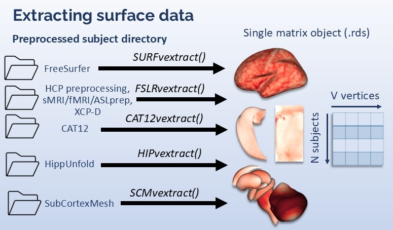

```{r setup, include=FALSE}
knitr::opts_chunk$set(dev = "jpeg", warning = FALSE, message = FALSE, dpi = 75)
library(VertexWiseR)
```

## Summary

-   [Extracting cortical surface data: from FreeSurfer](#id1)
-   [Extracting cortical surface data: from HCP processing, sMRIprep, fMRIprep, ASLprep or XCP-D](#id2)
-   [Extracting cortical surface data: from CAT12](#id3)
-   [Extracting hippocampal surface data: from HippUnfold](#id4)
-   [Extracting subcortical surface data: from SubCortexMesh](#id5)

------------------------------------------------------------------------

Surface extraction consists in reading through a preprocessing pipeline's subjects directory, collating the surface data (for a chosen vertex-wise measure, e.g. thickness), and summarising it into one compact matrix R object, with N rows per subject and M columns per vertex values.

```{r, echo=FALSE, fig.align="center", out.width="100%", fig.cap="Surface extraction methods workflow"}

```

The functions save such objects as a .rds file. The file contains the R surface matrix and, with the default subj_ID setting, an appended list of the corresponding subjects ID. This file can be shared across any device with R and all VertexWiseR statistical analyses functions can be run on these, without the need to access the initially preprocessed data.

As of version 1.5.0, 6 functions in VertexWiseR do surface data extraction and synthesis:

-   [SURFvextract()](https://cogbrainhealthlab.github.io/VertexWiseR/reference/SURFvextract.html)
-   [FSLRvextract()](https://cogbrainhealthlab.github.io/VertexWiseR/reference/FSLRvextract.html)
-   [CAT12vextract()](https://cogbrainhealthlab.github.io/VertexWiseR/reference/CAT12vextract.html)
-   [DTSERIESvextract](https://cogbrainhealthlab.github.io/VertexWiseR/reference/DTSERIESvextract.html)
-   [HIPvextract()](https://cogbrainhealthlab.github.io/VertexWiseR/reference/HIPvextract.html)
-   [SCMvextract()](https://cogbrainhealthlab.github.io/VertexWiseR/reference/SCMvextract.html)

The demo data (\~216 MB) required to run the surface extraction demos can be downloaded from the package's github repository with the following function:

```{r}
#This will save the demo_data directory in a temporary directory (tempdir(), but you can change it to your own path)
demodata=VertexWiseR:::dl_demo(path=tempdir(), quiet=TRUE)
```

## Extracting cortical surface data: from FreeSurfer {#id1}

SURFvextract() extracts cortical surface data from a preprocessed FreeSurfer subjects directory [@fischl_freesurfer_2012].

The function makes use of internal FreeSurfer functions to resample every participant's individual surface to fsaverage5 or fsaverage6. Therefore, it requires FreeSurfer to be installed and set in the environment where R is run and cannot be automatically run here.

For demonstration, we provide a subsample of 2 participants from the [SPRENG dataset](https://openneuro.org/datasets/ds003592/versions/1.0.13) [@spreng_neurocognitive_2022], after preprocessing their surface data using FreeSurfer's default recon-all pipeline. Certain files that were not needed (volumes, surfaces, label files) were removed to minimise the subsample's size.

We give the following code as example:

```{r, eval=FALSE}
SPRENG_CTv = SURFvextract(
  sdirpath = paste0(demodata,'/spreng_surf_data_freesurfer'), 
  filename = "SPRENG_CTv.rds",
  template='fsaverage5',
  measure = 'thickness',
  subj_ID = FALSE)
```

The following arguments can be used: \
- sdirpath: Path to the preprocessed subjects directory (will be used to define the SUBJECTS_DIR variable automatically).\
- filename: Name of the saved .rds output (can include a specific path to it). \
- template: The surface template space in which to extract the data, which can be 'fsaverage5' (default) or 'fsaverage6'. \
- measure: The name of the surface-based measure of interest computed [in FreeSurfer](https://surfer.nmr.mgh.harvard.edu/fswiki/UserContributions/FAQ). That includes cortical thickness ('thickness'), surface curvature ('curv'), depth/height of vertex ('sulc'), surface area ('area'), and 'volume' (for freesurfer 7.4.1 or later). Default is 'thickness'. \
- subj_ID Whether to obtain a list object containing both subject ID and data matrix instead of just the matrix (TRUE OR FALSE).

Here is an example of surface matrix object, extracted from FreeSurfer preprocessing of the all site 1 participants:

```{r}
SPRENG_CTv = readRDS(
  file = paste0(demodata,"/SPRENG_CTv_site1.rds"))
dim(SPRENG_CTv)
```

What dim(SPRENG_CTv) shows is that the matrix object contains the surface values of 238 participants, each with 20484 thickness values which correspond to the vertices of fsaverage5, both left-to-right hemispheres.

When the subj_ID argument is set to TRUE, the object returned is not a matrix on its own but a list containing both the matrix and an array listing the subject IDs from the directory. In our example: \* SPRENG_CTv[[1]] will be the list of subject IDs \* SPRENG_CTv[[2]] will be the matrix object

## Extracting cortical surface data: from HCP processing, sMRIprep, fMRIprep, ASLprep or XCP-D {#id2}

FSLRvextract() extracts cortical data in FSLR32k surface space from Human Connectome Project (HCP) [@van_essen_wu-minn_2013], sMRIprep [@esteban2021smriprep] (and outputs derived from it such as fMRIprep [@esteban_fmriprep_2019] and ASLprep [@adebimpe2022aslprep]) preprocessing output directories, as well as XCP-D [@mehta2024xcp] postprocessing output directories.

For demonstration, we provide a subsample of 2 participants from the [SPRENG dataset](https://openneuro.org/datasets/ds003592/versions/1.0.13) [@spreng_neurocognitive_2022], after preprocessing their surface data using fMRIprep. The latter outputs fslr32k surface data when using the "--cifti-output" option [@esteban_fmriprep_2019]. Other anatomical files were removed and only the dscalar.nii and associated json files were preserved, to minimise its size.

FSLRvextract() gets the data from .dscalar.nii files associated with the specified measure (e.g. thickness, curv), and can extract it as follows:

```{r, message=TRUE}
dat_fslr32k=FSLRvextract(
  sdirpath=paste0(demodata,"/spreng_surf_data/"),
  filename="dat_fslr32k.rds",
  dscalar="_space-fsLR_den-91k_thickness.dscalar.nii",
  subj_ID = FALSE,
  silent=FALSE)
```

The following arguments can be used: \
- sdirpath: Path to the preprocessed subjects directory. \
- filename: Name of the saved .rds output (can include a specific path to it). \
- dscalar: Suffix of the dscalar surface files. Because these files are named differently depending on the preprocessing pipeline, the user needs to specify what they are in the dataset. \
- subj_ID Whether to obtain a list object containing both subject ID and data matrix instead of just the matrix (TRUE OR FALSE). Default is TRUE. \
- silent: Whether to silence messages from the process (TRUE or FALSE). Default is FALSE.

Accordingly, the dat_fslr32k matrix will contain 2 rows (for 2 participants) and 64,984 columns (the subject's cortical thickness values in every vertex of the fslr32k surface).

Additionally, the [DTSERIESvextract()](https://cogbrainhealthlab.github.io/VertexWiseR/reference/DTSERIESvextract.html) function can be used on an individual CIFTI dtseries.nii typically outputted in the same space by the fmriprep pipeline, to get one subject's surface data across N time points.

## Extracting cortical surface data: from CAT12 {#id3}

CAT12vextract() was implemented in version 1.2.0 and can extract surface preprocessed with the CAT12 [@gaser_cat_2024] surface based morphometry pipeline. The function requires reticulate [@ushey_reticulate_2023] to run.

For demonstration, we provide again a subsample of 2 participants from the [SPRENG dataset](https://openneuro.org/datasets/ds003592/versions/1.0.13) [@spreng_neurocognitive_2022], after preprocessing their surface data using CAT12's SBM pipeline (segmentation and resampling without smoothing), and extracting different possible surface measures. Only the 32k mesh .gii and .dat files were kept.

CAT12vextract() extracts surface data resampled to 32k meshes (with or without smoothing) and can be used as in this example:

```{r, message=TRUE}
CATsurf=CAT12vextract(
  sdirpath=paste0(demodata,"/SPRENG_CAT12_subsample"),
  filename='CAT12_thickness.rds', 
  measure='thickness', 
  subj_ID = TRUE,
  silent = FALSE)
```

The following arguments can be used: \
- sdirpath: Path to the preprocessed subjects directory (will be used to define the SUBJECTS_DIR variable automatically). We recommend that the directory follows the [BIDS](https://bids.neuroimaging.io/) structure for accuracy. \
- filename: Name of the saved .rds output (can include a specific path to it) \
- measure: The name of the surface-based measure of interest computed [in CAT12](https://neuro-jena.github.io/cat12-help/#sbm). That includes 'thickness', 'depth', 'fractaldimension', 'gyrification', and 'toroGI20mm'. \
- subj_ID Whether to obtain a list object containing both subject ID and data matrix instead of just the matrix (TRUE OR FALSE)

Accordingly, the matrix will contained 2 rows (for 2 participants) and 64,984 columns (the subject's cortical thickness values in every vertex of the 32k mesh):

```{r}
#The surface object contains the surface matrix and the list of subjects ID (and session number if applicable)
names(CATsurf)
#The surface matrix dimensions:
dim(CATsurf$surf_obj)
```

## Extracting hippocampal surface data: from HippUnfold {#id4}

HIPvextract() extracts cortical data in CITI168 surface space from the HippUnfold preprocessing pipeline [@dekraker_evaluation_2023]. As opposed to the other two functions, HIPvextract() does not require any system requirement.

For demonstration, we provide a subsample of 2 participants from the [Fink dataset](https://openneuro.org/datasets/ds003799/versions/2.0.0) [@fink_two-week_2021], after preprocessing their surface data using HippUnfold, keeping all output .gii files.

To extract and collate the data of the two participants, HIPvextract() can be run as follows:

```{r, message=TRUE}
hipp_surf=HIPvextract(sdirpath=paste0(demodata,
                                      "/fink_surf_data"),
            filename="hippocampal_surf.rds",
            measure="thickness",
            subj_ID = TRUE) 
```

The following arguments can be used: \
- sdirpath: Path to the preprocessed subjects directory. \
- filename: Name of the saved .rds output (can include a specific path to it). \
- measure: The name of the surface-based measure of interest computed [in HippUnfold](https://hippunfold.readthedocs.io/en/latest/outputs/output_files.html#surface-metrics). That includes 'thickness','curvature','gyrification' and 'surfarea'. Default is 'thickness'. \
- subj_ID: Whether to obtain a list object containing both subject ID and data matrix instead of just the matrix (TRUE OR FALSE). Default is TRUE.

Note that when subjects directories have multiple sessions, the matrix object will contain N rows per participant and per session.

```{r}
hipp_surf[[1]]
```

Here the matrix has 6 rows for 2 particiants with 3 sessions each; and 14,524 columns (the hippocampal thickness values in every vertex of the CITI168 surface).

```{r}
dim(hipp_surf[[2]])
```

## Extracting subcortical surface data: from SubCortexMesh {#id5}

SCMvextract() extracts subcortical data based on FreeSurfer ASeg [@fischl_freesurfer_2012] or FSL FIRST [@PATENAUDE2011907] volumetric subcortical segmentations, converted to surfaces via the python pipeline from [SubCortexMesh](https://github.com/chabld/SubCortexMesh). SCMvextract() does not require any system requirement, but further plotting and modelling will require downloading associated template data (the package will prompt you automatically or you may do it directly by typing `VertexWiseR:::scm_database_check(template='fsaverage')`, with 'fsaverage' for FreeSurfer template data or 'fslfirst' for FSL FIRST template data).

For demonstration, we provide a subsample of 2 participants from the [SUDMEX_CONN](https://openneuro.org/datasets/ds003346/versions/1.1.2) dataset [@PMID:28485734], after preprocessing them via FreeSurfer's recon-all pipeline, and computing their surface data using SubCortexMesh, keeping all output .vtk files.

To extract and collate the data of the two participants:

```{r, message=TRUE}
subcortical_Tv = SCMvextract(
  sdirpath = paste0(demodata,'/sudmex_conn_surf_data_subcortexmesh/'), 
  outputdir = "subcortical_matrices",
  template = 'fsaverage',
  measure = 'thickness',
  roilabel= c('thalamus','caudate'),
  subj_ID = TRUE,
  silent= FALSE)
```

The following arguments can be used: \
- sdirpath: Path to the surface_metrics output directory \
- filename: Name of the directory that will contain each subcortical region's .rds matrix (can include a specific path to it) \
- template: The name of the template the surfaces are computed from in SubCortexMesh (includes 'fsaverage' and 'fslfirst'). \
- measure: The name of the surface-based measure of interest computed [in SubCortexMesh](https://github.com/chabld/SubCortexMesh). That includes 'thickness','curvature','surfarea'. Default is 'thickness'. \
- roilabel: One name or vector of names of the subcortical region(s) to extract. This is optional, all subcortices will be included if the argument is not provided. \
- subj_ID: For each separate subcortical matrix, whether to obtain a list object containing both subject ID and data matrix instead of just the matrix (TRUE OR FALSE). Default is TRUE. \
- silent: Whether to silence messages from the process (TRUE or FALSE). Default is FALSE.

As opposed to other extraction functions, multiple matrices (one for each subcortical area, bilateral when applicable) are saved inside the path indicated in "outputdir", and returned together in a single list object:

```{r}
names(subcortical_Tv)
subcortical_Tv[['caudate']]$sub_list
dim(subcortical_Tv[['caudate']]$surf_obj)
dim(subcortical_Tv[['thalamus']]$surf_obj)
```

```{r, echo=FALSE}
#for clean up
unlink('SPRENG_CTv.rds')
unlink('dat_fslr32k.rds')
unlink('CAT12_thickness.rds')
unlink('hippocampal_surf.rds')
unlink('subcortical_matrices', recursive = T)
```

## References:
